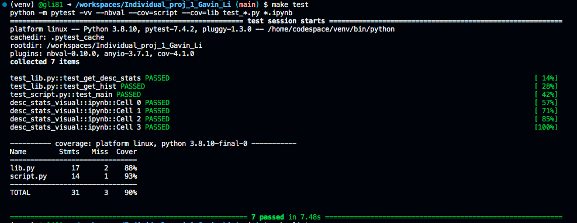
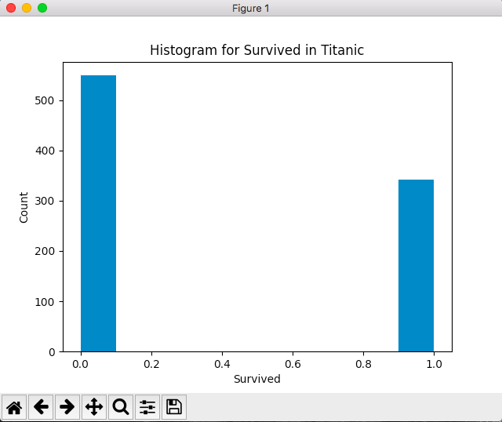

# IDS 706 Data Engineering Individual Project # 1

Gavin Li `gl183`

## Video Link

[The link for the demo video](https://youtu.be/u9MoUnZqlRo)

## Purpose of the Project

The purpose of the individual project #1 is to conduct data analysis using either Pandas or Polars in both Jupyter Notebook and python script. I use Pandas to conduct the analysis.

## Template

For this project, I use the ruff template as the foundation of my repo.

This template lints code using `ruff` instead of `pylint`, which was used in the first two mini projects.

### `make format` result

### `make test` result

### `make lint` result

## Descriptive Statistics using Python Pandas in both python script and jupyter notebook

1. Read the csv file at `./resources/train.csv` using `pandas.read_csv()` function

2. Generated sumamry statistics for variable `Survived` in the `Titanic` dataset using `.median()`, `.mean()`, `.std()` function. The result is as follow:

3. Generated histogram for variable `Survived` in the `Titanic` dataset using `matplotlib.pyplot`.

## References

[Professor Noah's ruff template](https://github.com/nogibjj/python-ruff-template)